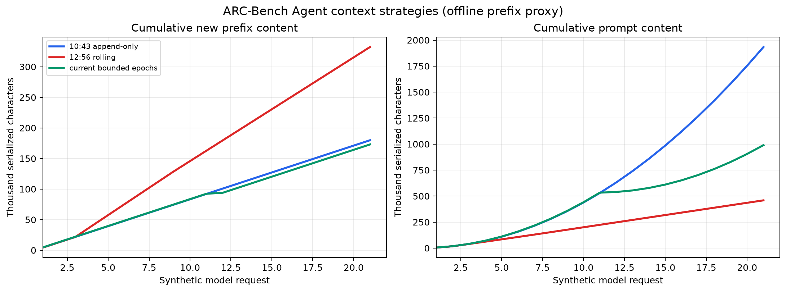
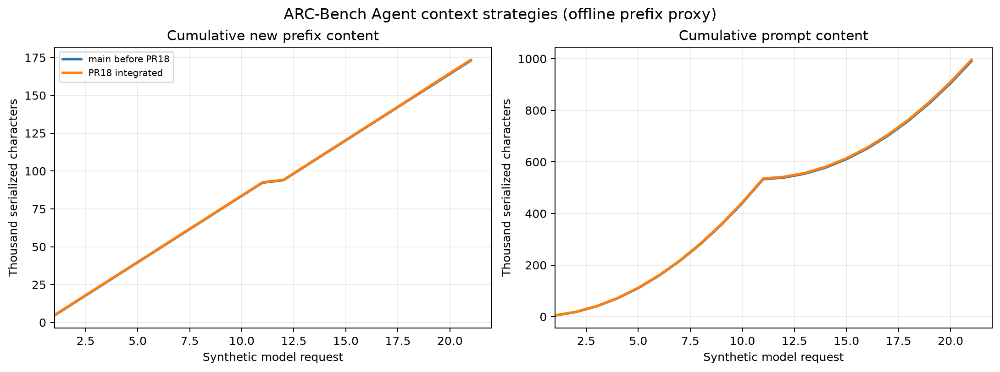
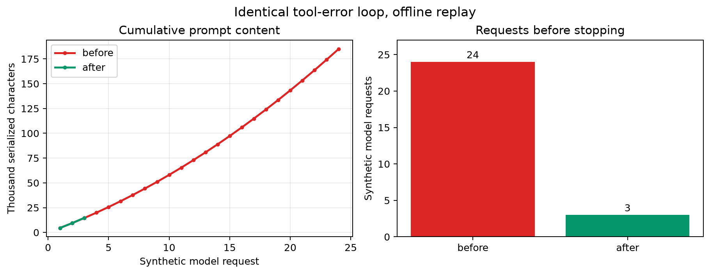
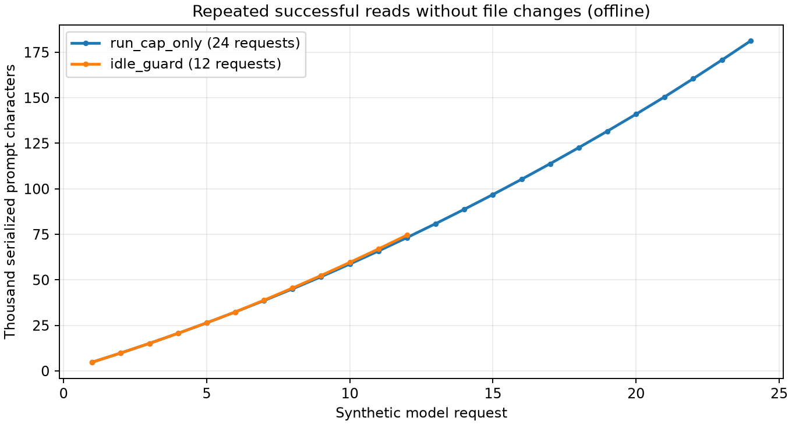

# ARC-Bench Agent 性能改动与离线对照

日期：2026-09-28。范围：当前工作区相对于本地保存的两份历史上传 ZIP。所有曲线均由确定性假模型产生，**没有调用付费模型**。

## 本次落实的改动

| 改动 | 作用 | 验证 |
| --- | --- | --- |
| 有界连续上下文、请求及 token 上限 | 限制无限增长和循环调用，同时尽量维持稳定请求前缀 | 完整单元测试；离线前缀对照 |
| 截断响应检测 | `finish_reason=length` 时明确报错，避免把半截方案或代码当作完成 | 截断模拟测试 |
| 分层验收 | 构建和结构检查通过后才开始视觉评审 | 失败验收模拟测试 |
| 定向修复 | 用失败检查与相关文件选择待修复模块；无法定位时回退全模块 | 定向/回退模拟测试 |
| 精确局部替换 | 仅在旧文本唯一匹配时原子写回，并返回新文件哈希 | 冲突与成功路径测试 |
| 请求与工具计时 | 日志记录模型阶段耗时、工具耗时与返回长度，结束时汇总 | 完整单元测试 |

思考模式继续默认开启。请求上限是保护措施，不能证明任务会在该额度内成功；定向修复也不能代替最终的全量验收。

## 对照方法

`scripts/benchmark_performance.py` 对每一版执行相同的 21 次模拟请求：20 次工具调用，每次返回 8,000 字符；第 21 次结束。每次请求序列化为 JSON 后，计算它与**紧前一次请求**完全相同的起始字符数。`新前缀字符 = 本次提示词字符 - 共同起始字符`，并累计两项指标。

两份 ZIP 是本地保留的 10:43 追加式历史版本和 12:56 滚动压缩版本；当前版本从工作区代码导入。源文件名、参数和逐轮数据保存在 [原始数据](performance/context-prefix-data.json)。本图可由 `scripts/plot_performance.py` 与该 JSON 重绘；作图脚本需要本地安装 matplotlib，它不是 Agent 运行依赖。

| 策略 | 累计提示词字符 | 累计新前缀字符 | 新前缀占比 |
| --- | ---: | ---: | ---: |
| 10:43 追加式 | 1,933,690 | 179,890 | 9.3% |
| 12:56 滚动压缩 | 459,019 | 332,304 | 72.4% |
| 当前有界分段 | 990,482 | 173,007 | 17.5% |

相对于 12:56 版本，当前版的累计新前缀字符减少 **47.9%**，累计提示词字符增加 **115.8%**。相对于 10:43 版本，新前缀字符减少 **3.8%**，累计提示词字符减少 **48.8%**。这说明当前策略在该合成负载下取得了不同的折中，不能单凭一列判断实际费用。

**指标边界：** 新前缀字符只是潜在缓存复用的代理量，既不是 DeepSeek 报告的 `cache_hit_tokens`，也不是未缓存 token、账单金额或运行时间。服务商的 token 化、缓存长度门槛、过期策略、图片与工具 schema 处理都可能改变结果。该模拟也没有评估生成网站的正确率。因此不能声称本次代码已降低实际付费或通过 ARC-Bench 平台任务。

## 整体测试记录

每一步代码修改后均运行 `python -m unittest discover -s tests -q`，使用同一项目虚拟环境。测试使用本地临时目录，初次普通沙箱运行受 Windows 临时目录 ACL 阻断；改为允许访问项目临时目录后，以下完整测试均通过。秒数是测试套件的墙钟时间波动，**不作 Agent 性能收益判断**。

| 检查点 | 测试数 | 结果 | 耗时 |
| --- | ---: | --- | ---: |
| 基线与旧测试夹具修正 | 63 | 通过 | 4.079 秒 |
| 截断响应检测 | 64 | 通过 | 4.830 秒 |
| 分层视觉验收 | 65 | 通过 | 4.070 秒 |
| 定向修复 | 66 | 通过 | 4.045 秒 |
| 精确局部替换 | 68 | 通过 | 5.824 秒 |
| 模型和工具计时 | 68 | 通过 | 4.813 秒 |
| 离线前缀探针 | 68 | 通过 | 4.097 秒 |
| 曲线脚本与版式调整 | 68 | 通过 | 6.066 / 4.303 秒 |
| 报告、建议与使用说明同步 | 68 | 通过 | 4.991 / 4.007 / 4.056 秒 |

后续要评估真实收益，应从同一初始任务和项目出发，先进行一组有费用上限的 A/B 运行，记录平台实际用量、缓存命中、用时和验收结果；当前尚无这组数据。

## PR #18 整合：工具指导与预算提醒

同伴提交 `1493f96` 的工具使用指导、精确行为约束和低预算提醒已适配当前主线。整合保留系统指令、批量工具、可选的单次实现轮数，以及**整次运行**的工具调用上限；不会在修复轮次重置全局调用计数。DeepSeek 思考模式下无效的固定 `temperature` 参数未移植。

用相同的 21 次模拟请求、20 个 8,000 字符工具结果进行离线对照；[逐轮数据](performance/pr18-prefix-data.json)及曲线如下。修复前基线为 `70b3c36`，整合代码为 `6258647`。作图仍使用 `scripts/plot_performance.py`。

| 版本 | 累计提示词字符 | 累计新增前缀字符 | 模拟请求数 |
| --- | ---: | ---: | ---: |
| 主线基线 | 990,482 | 173,007 | 21 |
| PR #18 整合 | 995,609 | 173,444 | 21 |

新增提示词使该离线负载的累计字符增加约 **0.5%**，新增前缀字符增加约 **0.3%**。这只度量固定模拟工具序列的请求体，不能证明生成质量、真实缓存命中、费用或用时改善。隔离工作区的完整单元测试 **71 项通过**，包含默认 `None` 限制、跨轮全局工具上限和低预算提醒测试；还需要实际任务验收。
## 后续修复：重复工具错误止损

在提交 `70b3c36` 后发现，实现模型如果连续发出同一组失败的工具调用，原流程会持续重试直至总请求额度耗尽。现在第二次相同失败后给出纠偏提示，第三次仍完全相同则停止本轮、保留已有文件并运行可用的项目检查；若下一轮改用其他调用，则正常继续。诊断记录失败工具名和截短错误，不把此情形记为成功。

`scripts/benchmark_stalled_tools.py` 对 `70b3c36` 的源码 ZIP 与修复后的工作区运行同一份离线错误序列：每轮模型都请求读取同一个缺失文件，工具抛出同一异常，最多允许 24 次模型请求。无真实模型、网络或付费调用。结果与逐轮数据见 [错误循环对照数据](performance/stalled-tool-data.json)。

| 离线错误循环 | 模型请求数 | 累计序列化提示词字符 | 停止原因 |
| --- | ---: | ---: | --- |
| 修复前 `70b3c36` | 24 | 185,070 | 总请求上限 |
| 修复后 | 3 | 14,758 | 相同失败工具调用上限 |

在这一特定合成错误循环中，请求数减少 **87.5%**，提示词字符减少约 **92.0%**。正常任务可能不会触发保护；这组数据不能推出真实任务的平均用时、token 费用或完成率改善。完整测试增加两项：确认第三次相同失败止损，以及模型改变工具调用后可继续完成；改动后的全套 **70 项测试通过**。曲线由 `scripts/plot_stalled_tools.py` 根据已提交数据生成，matplotlib 仅用于本地作图。

## 连续成功读取却不修改文件的停止规则

用户提供的 2026-09-28 09:08–09:35 平台日志包含 **274 次模型请求**，其中第 271 次才开始第二个模块；累计报告 **5,544,902 输入 token、304,694 输出 token**，228 次响应的输出不超过 1,000 token。其间有 17 次“当前构建和测试脚本通过”的检查，最后由运行器暂停。日志没有工具参数、文件修改明细或缓存命中字段，因此不能证明每次调用的具体内容，也不能由 token 总量推算账单或缓存命中率；它能证明旧流程缺少有效的模块收敛条件。该运行早于本报告的默认总预算和 PR #18，不能当成当前版本的实测结果。

整合版新增无进展检查：连续 6 轮工具调用未写入文件时给模型一次提醒；连续 12 轮仍未写入时运行检查。本模块曾写入文件且现有构建与测试脚本通过，就将控制权交给下一个需求模块；否则以 `no_progress_tool_turn_limit` 失败，保留文件与诊断。该机制不会把失败或无法执行的检查当作通过。`ARCBENCH_MAX_IDLE_TOOL_TURNS` 可调整默认的 12 轮阈值。

`scripts/benchmark_idle_tools.py` 用相同的 24 次总请求上限，模拟模型每轮成功读取目录、始终不修改文件；一组将无进展阈值设为 50（由总请求上限停止），另一组使用默认 12。没有网络或付费模型调用。[逐轮数据](performance/idle-tool-data.json)及曲线如下。

| 离线场景 | 模型请求数 | 累计序列化提示词字符 | 停止原因 |
| --- | ---: | ---: | --- |
| 仅总请求上限 | 24 | 181,209 | 24 次总请求限制 |
| 12 轮无进展检测 | 12 | 74,604 | 连续无文件改动 |

在该合成序列中，请求数减少 **50.0%**，序列化提示词字符减少约 **58.8%**。这不能代表真实 token 账单、缓存命中率或网站功能通过率。整合分支的全套离线测试 **76 项通过**；真实 ARC-Bench 验收仍待验证。
